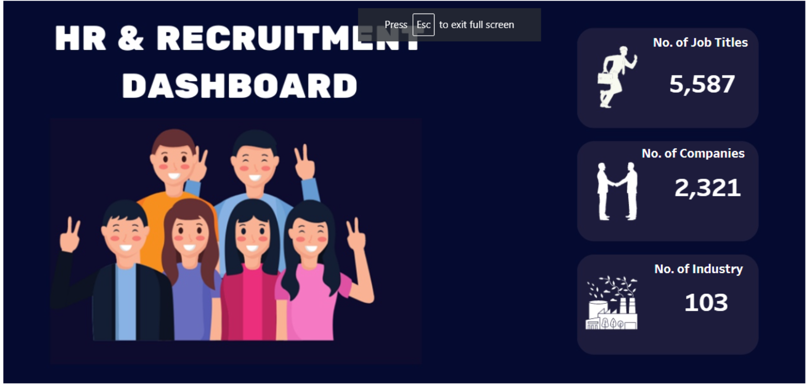
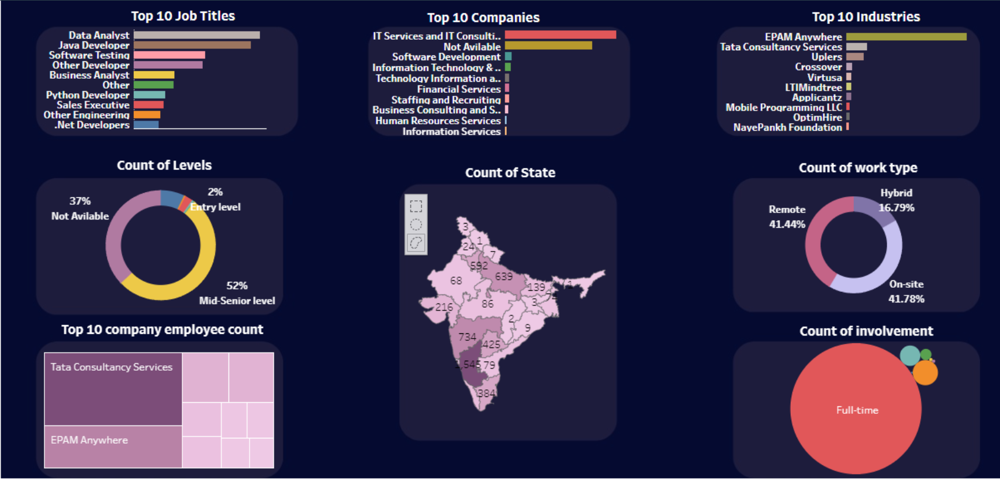
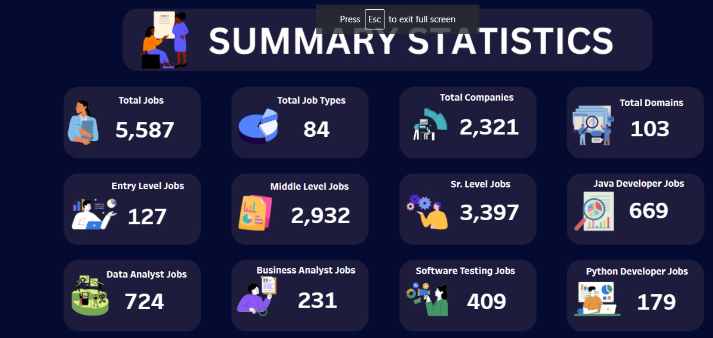

# Company HR Recruitment Insights

**Author:** Romil Raj  
**Institution:** BIT MESRA RANCHI  
**Email:** rajromilk23@gmail.com  
**LinkedIn:** https://www.linkedin.com/in/romil-raj-80983728a/

## Introduction
This project focuses on extracting insights from a large dataset related to recruitment and placement activities in companies. The dataset provides valuable information that can be used by the HR department to gain knowledge about the recruitment process and market trends. The project involves several steps, including data scraping, data cleaning, exploratory data analysis (EDA), and building a dashboard using Tableau.

## Folder Structure Guide

| Files/Folder        | Description                                                             |
|---------------------|-------------------------------------------------------------------------|
| Notebooks Folder    | This folder includes the Jupyter Notebook files that were utilized to scrape the data from the web.                                  |
| Dataset Folder      | Within this folder, there are two CSV tables that were acquired by scraping data from the web.                                   |
| Presentation Folder | This folder contains the presentation in PDF format.                                   |
| Dashboard File      | This is a Power BI-based dashboard that we developed to generate insights.                                   |
|Scraping Folder      | Within this folder, the python scraping file is there           |

## Project Steps
1. **Scraping Data from LinkedIn:** The data is collected from the professional networking platform LinkedIn using the Python library Beautiful Soup or a similar tool. The scraping script is available in the notebook named `Linkdin_scraping.ipynb`.

2. **Data Cleaning:** The collected data is cleaned and preprocessed to ensure its quality and consistency. The data cleaning process is performed in the notebook named `Data_Cleaning.ipynb`.

3. **Exploratory Data Analysis (EDA):** The cleaned data is analyzed to gain insights into various aspects of the recruitment process. The EDA is conducted using Python in the notebook named `EDA_Python.ipynb`.

4. **Dashboard Creation:** A dashboard is built using Tableau to visualize and present the extracted insights in an interactive and informative manner.

## Data Summary
The provided LinkedIn dataset consists of 7,927 rows and 15 columns, offering a comprehensive overview of job postings available on the platform. This dataset can be utilized for data analysis, visualization, and research purposes. The job postings encompass various roles such as Data Analyst, Machine Learning Engineer, IT Services, and IT Consulting, located in diverse locations worldwide, with varying salaries and work hours. The dataset provides information about the company, role responsibilities, and required skills for each job. It serves as a valuable resource for understanding job opportunities in different industries and locations.

## Column Descriptions
The dataset contains the following columns:

| Column Name      | Description                                                        |
|------------------|--------------------------------------------------------------------|
| job_ID           | Unique identifier for each job listing.                             |
| designation      | The title or position of the job.                                  |
| company_id       | Unique identifier for each company.                                |
| name             | Name of the company offering the job.                              |
| work_type        | Indicates whether the job is remote or on-site.                    |
| involvement      | The level of involvement required for the job (e.g., Full-time, Part-time). |
| employees_count  | The count of employees in the company.                             |
| total_applicants | The total number of applicants for the job.                        |
| linkedin_followers | The number of followers on the company's LinkedIn page.           |
| job_details      | Description of the job and its responsibilities.                   |
| details_id       | Unique identifier for the job details.                             |
| industry         | The industry or sector to which the company belongs.               |
| level            | The experience level or seniority associated with the job.         |
| City             | The city where the job is located.                                 |
| State            | The state where the job is located.                                |

## Issues with the Dataset
The dataset exhibits several issues that require attention:

1. Dirty Data:
   - The `job` column contains unnecessary information such as yearly package, technology, company name, and work type (remote) added in the title.
   - The `no_of_application` column includes values like 'hours' and 'minutes' that should not be present.

2. Consistency:
   - In the `posted_day_ago` column, time is added in the form of strings, such as '9 hours' and '8 minutes'.
   - The `Alumni` column includes strings with the count value ('company alumni').
   - The `Hiring_person` column contains nicknames added within parentheses.

3. Completeness:
   - The `company_id` column is completely blank.

4. Validity:
   - The `linkedin_followers` column contains the string 'linkedin_followers' with numbers, where numbers are separated by ', '.
   - The `Full_time_remote` column combines involvement and level in one column, separated by '·'.
   - The `No_of_employ` column combines employees_count and industry in one column, with the 'employees' string added unnecessarily, separated by '·'.
   - The `location` column combines country, state, and city in one column, separated by ','.

5. Messy Data:
   - In the `Job` column, some entries start with capital letters while others are in small letters.
   - The `company_name` column has inconsistencies in the name, with some letters starting with lowercase and others with a capital letter.
   - There are 2,084 duplicate values found in the dataset.

## Data Cleaning and Preprocessing
- Remove duplicate values from the DataFrame.
- Replace or remove null values based on analysis.
- Assign unique identifiers to the "company_id" column based on the order of appearance in the DataFrame.
### Handling missing values
  - All the column has the null value except `job_ID` and `company_id`
  - `job` has **27** Null values -- This column has the less null value we can remove all the null values
  - `location` has **27** Null values -- This column also has less null value so we can directly remove all
  - `company_name` has **28** Null values -- This column also has less null value so we can directly remove all
  - `work_type` has **132** Null values -- Since the data in this column is object type we can replace it with the mode 
  -`full_time_remote` has **67** Null values -- This column also has less null value so we can directly remove all
  - `no_of_employ` has **229** Null values -- This column also has less null value so we can directly remove all
  -`no_of_application` has **33** Null values -- either we can remove it or replace it with the 0 because I know for a fact there are null values because at that time there is no application
  -`posted_day_ago` has **6** Null values -- This column also has less null value so we can directly remove all
  - `Hiring_person` has **1686** Null values -- In this, we are going to replace the null values with 'Not Available'
  -`linkedin_followers` has **2313** -- In this column there is a possibility there are 0 followers so null is placed insist of it but I am going to replace it with the mean.
  -`job_details` has **44** Null values -- This column also has less null value so we can directly remove all
#### steps involved in the data cleaning process
- Check the top 5 and last 5 rows of the DataFrame.
- Check for null values and calculate their percentage column-wise.
- Check the data types and count of non-null values in the DataFrame.
- Check for duplicate values in the dataset.
- Create a copy of the DataFrame.
- Remove duplicate values and reset the index.
- Assign a unique identifier to each company based on their order of appearance in the DataFrame.
- Assign unique numerical identifiers to companies and jobs based on their order of appearance in the DataFrame.
- Drop unnecessary columns.`'location','posted_day_ago','Hiring_person','alumni','hiring_person_link'`
- Remove unwanted strings from the DataFrame.
- Separate columns and handle null values generated.
- Replace null values in the "company_sector" and "job_level" columns.
- Remove null values in the "posted_day_ago" column.
- Separate the city and state from the "location" column.
- Install the geopy module.
- Create functions to find states and cities based on given cities.
- Apply the functions to extract state and city information.
- Check for noise values in the "City" and "State" columns.
- Replace noise values in the "State" column.
- Identify noise in the "job" column and categorize it accordingly.

## Insights
The following are some of the key insights obtained from the analysis:

- Data analyst positions are highly sought after in the job market at all levels, indicating significant demand for professionals with data analysis skills.

- Java developers continue to enjoy abundant job opportunities, highlighting the continued popularity and relevance of Java programming in the industry.

- Other developer roles, such as software testing and C development, are also in demand at various levels, demonstrating the need for expertise in these areas.

- The job market offers a range of options, including full-time, contract, part-time, on-site, and remote positions, providing flexibility for both employers and employees.

- Data analysis skills are considered essential, with data analysts leading the way in job availability, reflecting the growing importance of leveraging data-driven strategies in decision-making processes.

- The demand for data analysts across industries underscores the vital role they play in enabling organizations to make informed decisions based on data insights.

- The availability of job opportunities at different levels within the data analysis field signifies the potential for growth and advancement in this career path. Additionally, the ongoing popularity of Java programming suggests its continued relevance in the development landscape, making it a valuable skill for software professionals to possess.

- Internships and part-time jobs often allow people to work from home or another location using a computer. Many of these jobs, around 71% for internships and 66% for part-time jobs, can be done remotely. This means people don't have to go to an office or workplace. Employers offering these types of jobs are more likely to provide the option to work remotely.

- Executives and associates prefer on-site work due to the need for guidance and collaboration.

- Internships and mid-Senior level positions correlate with remote work, driven by factors such as unpaid internships and the experience level of employees.

- According to the analysis, the data analyst role has the highest job count, with over 700 positions, making up 62.1% of the job share within the Analytics field. Following closely is the business analyst role, with over 200 positions, representing 19.8% of the job share. These findings indicate a strong demand for professionals in both data and business analytics, highlighting the significance of these roles in the job market.

For more detailed information and visualizations, please take a look at the respective notebooks and the final dashboard.

## Dashboard Screenshot

## Suggestion to the HR department

- Focus on recruiting and retaining skilled data analysts: Given the high demand for data analysts at all levels, it is crucial to invest in attracting and retaining talent with strong data analysis skills. Implement effective recruitment strategies, offer competitive compensation packages, and provide opportunities for professional development and growth within the organization.

- Build a strong talent pipeline for Java developers: Recognize the ongoing popularity and relevance of Java programming in the industry. Establish partnerships with educational institutions and coding boot camps to create a pipeline of skilled Java developers. Provide training programs and mentorship opportunities to nurture their skills and ensure a steady supply of qualified candidates.

- Address the demand for other developer roles: Identify the need for expertise in areas such as software testing and C development. Develop targeted recruitment strategies to attract professionals with these skills, including leveraging specialized job boards, attending relevant industry events, and engaging with developer communities. Provide growth opportunities and create an environment that encourages continuous learning in these areas.

- Offer flexible work options: Given the prevalence of remote work opportunities, consider implementing flexible work options for employees. This can attract a wider pool of candidates and improve work-life balance. Develop policies and technologies that support effective remote collaboration and ensure productivity is maintained regardless of the work location.

- Foster a data-driven culture: Recognize the growing importance of data analysis and the role it plays in decision-making processes. Encourage employees at all levels to develop data analysis skills and promote a data-driven culture within the organization. Provide training, tools, and resources to empower employees to make informed decisions based on data insights.

- Stay updated on industry trends: Continuously monitor the job market and industry trends to ensure that the HR department stays informed about changing demands and skills requirements. Adapt recruitment strategies and job descriptions accordingly to attract the most suitable candidates for various roles.

